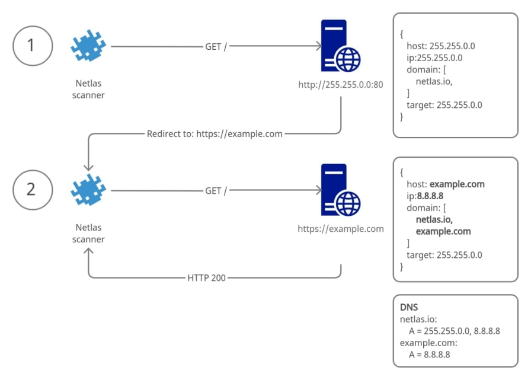
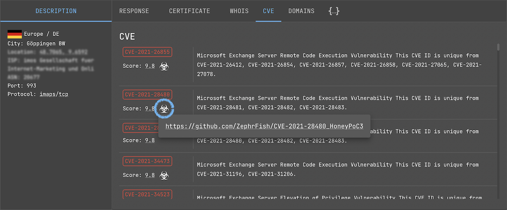

<!-- 
including but not limited to the following:

- __Netlas scanners__, which scans the entire range of IPv4 addresses from 1.0.0.0 to 239.255.255.255 (excluding reserved ranges) making requests by IP addresses and hundreds of millions of domain names;
- __Netlas resolvers__, which continiously updates information on billions of DNS records;


Netlas contains up-to-date information from scanning the entire range of IPv4 addresses on the internet and hundreds of millions of domain names. It includes a database of internet network DNS records, WHOIS databases for both IP addresses and domain names, as well as an SSL certificate database. 

All this data is parsed and well-structured, enriched with tags, technology names, vulnerability data, geographical locations, and more.

Netlas.io is a search engine and a set of complementary tools. Netlas users access the data through the web interface, API, and command line. The web interface provides an effortless way to explore search results, and the intuitively understandable syntax of queries allows users to start working after just a few trial queries. Users leverage the API to integrate Netlas into their applications. The command-line interface enables the easy and swift development of scripts to automate work processes.


It would be wrong to say that Netlas (or any of our competitors) scans the entire Internet. It is not even possible to scan every IPv4 address on all 65535 ports in a reasonable amount of time. Thus, we scan the Internet against a specific list of commonly used ports.

The number of ports to scan increases from time to time in proportion to our infrastructure. To determine which ports are being scanned, you can use the grouping feature in the search results. Grouping can be done by the «port» field ([search link](https://app.netlas.io/responses/stats/?q=*&page=1&fields=port&indices=&size=100)).

We are constantly improving the scanning technology and the scanners themselves. At present, Netlas identifies and parses over 25 application protocols, including:

- commonly used DNS, FTP, HTTP, SMB, NETBIOS, SNMP, SOCKS, NTP;
- email related IMAP, POP3, SMTP;
- DBMS protocols, including Elasticsearch, Memcached, Mongodb, MSSQL, MYSQL, Oracle, Redis, Postgres;
- IoT protocols, like AMQP, Telnet, Modbus, MQTT and S7;
- remote access protocols, including RDP, VNC, SSH, etc.

The HTTP protocol is worth mentioning separately. To effectively gather data from web servers, we query them not only by IP address but also by domain names. Therefore, if multiple websites or web applications are hosted on the same web server, Netlas will query them one after another.

When Netlas queries a service, it always makes a standard request for that protocol, then parses and saves the received response. For example, for the HTTP protocol, a standard GET request for the root (index) page is executed. The data collected in this way is a valuable source of information for research. Especially with the ability to perform full-text search, search using regular expressions, and even search by fields unique to specific protocols. Analyzing the saved responses often allows for the identification of software, in many cases, even down to the specific version. Netlas identifies over a thousand applications in this way.

If the research target is an application not currently detected by Netlas, you can still perform detection yourself by making a search query in a specific manner. Alternatively, you can refer to one of our repositories on Github1, where we periodically publish examples of search queries. Identification of an application or device can be achieved through a multitude of different indicators:

- port number and protocol combination;
- part of a text message in the banner;
- a specific value in any section of the response, for example, a specific header;
- unique field in the SSL certificate;
- favicon (for web applications);
- specific service publication URL;
- combination of various features.

In Netlas development, we have gone even further. In addition to the full user response, additional information is available, such as geodata, tags, WHOIS data, etc. These features significantly enhance the value of the data for research purposes.
Next, we will explore some scenarios of Netlas usage related to Security Research and Threat Intelligence.


Now when you learned where to locate the necessary data, you can't go wrong with the search tool. But in order to effectively use Netlas search tools, you also need to become familiar with the search syntax and structure of documents that are stored in the collections described above.


__Tokenization__

About text and keyword. All except emails and domains. Also http.body. -->

# Responses Data Collection

This data collection consists of Internet crawling results. Netlas scans the entire range of IPv4 addresses from 1.0.0.0 to 239.255.255.255 (excluding reserved ranges) against a specific list of commonly used ports. The number of ports to scan increases from time to time in proportion to our infrastructure.

??? info "List of ports scanned during regular internet scan"
    **TCP ports**: 7, 13, 21, 22, 23, 25, 37, 53, 79, 80, 81, 88, 102, 106, 110, 111, 113, 119, 135, 139, 143, 179, 199, 389, 443, 444, 445, 465, 502, 515, 548, 554, 587, 631, 646, 808, 809, 873, 990, 993, 995, 1025, 1026, 1027, 1028, 1029, 1080, 1110, 1337, 1433, 1443, 1521, 1723, 1883, 1900, 2000, 2001, 2049, 2095, 2096, 2121, 2222, 2376, 2443, 2525, 3000, 3128, 3306, 3389, 3790, 4343, 4443, 4444, 4449, 4782, 5000, 5001, 5009, 5060, 5190, 5357, 5432, 5671, 5672, 5800, 5900, 5984, 6000, 6001, 6066, 6379, 6501, 6606, 7001, 7002, 7070, 7443, 7547, 7707, 8000, 8001, 8002, 8008, 8009, 8010, 8080, 8081, 8088, 8090, 8091, 8123, 8222, 8333, 8443, 8500, 8808, 8888, 8899, 9000, 9100, 9191, 9200, 9443, 9998, 9999, 10000, 10443, 11211, 12443, 22222, 27017, 30443, 31337, 40056, 40443, 41337, 49152, 49153, 50000, 50050, 50443.

    **UDP ports**: 53, 123, 137, 161, 162.

To effectively gather data from web servers, Netlas scanners query them not only by IP address but also by domain names. Therefore, if multiple websites or web applications are hosted on the same web server, Netlas will query them one after another.

Documents in this collection include the following:

* The full server response
* An SSL certificate that was included in the host response
* Favicon information (http/https)
* Application and version detection results
* Additional data (ip whois, geo location, asn, fqdn, CVE, and other information)


## Ports and Protocols

### Port, prot4, prot7 & protocol fields

Netlas.io provides several ways to set search criteria for responses search. First of all, you can use the `port` field to indicate a port or an interval:

```
port:1883
```

```
port:[1000 TO 10000]
```

Use the `prot4` field to filter out services using TCP or UDP as transport.

```
prot4:udp AND port:161
```

The `prot7` field is intended for filtering by OSI model Layer 7 protocols (an application layer protocols), such as HTTP, FTP, IMAP, SMB and others. The `protocol` field is basically the same as `prot7` except for the differences between protocol versions.

Compare:

* `Prot7` field can take values http, smtp, pop3 and so on.
* `Protocol` field can take values http, https, elasticserach (based on http), smtp, smtps, pop3, pop3s, pop3startls.

The search query `protocol:(t3 OR t3s)` returns the same as `prot7:t3`.

```
prot7:ntp
```

```
protocol:(pop3s OR pop3starttls)
```

```
prot7:ssh AND NOT port:22
```


### Queries with Protocol Fields

Netlas responses search engine has advanced support for the most common network protocols, such as HTTP, FTP, SSH, email protocols, database protocols and others. It means that host response fields are available as search query parameters. You can find a list of supported protocols on the mapping panel (fields available to search) under the "Protocols" section.

Available fields are differs depending on the protocol. For some protocols (such as IMAP or T3) only the banner field is available. In other cases, there are many specific fields.

```
smb.smbv1_support:true
```

```
t3.banner:"10.3.6.0"
```

```
smtp.banner:EXIM
```

```
\*.banner:test
```

The Netlas team extends application protocols support from time to time. You can post a request to add support for the protocol you need via the feedback form.


### HTTP Protocol Search

Netlas parses and saves the first 100Kbytes of each response during the scan. In the vast majority of cases, this is enough to save a full server response. HTML pages are stored in the `http.body` field. A full-text search and regex are available for this field. So it is possible to search across the entire body of a web page.

Other useful fields are `http.headers` and `http.unknown_headers`. The `http.headers` field points to 1000 of the most used HTTP headers. Other headers are stored as key-value pairs in the `unknown_headers` field. Use mapping or autosuggestion to find the header you need (start typing a header name after `http.headers.` in the search bar).

!!! info "Please note:"
    All '-' characters (dashes) in header names are replaced with the '\_' characters due to our database limitation. So use `http.headers.content_security_policy` instead of `http.headers.content-security-policy`


Some other interesting fields in the http web response:

* `status_code` – web server response status code.
* `content_length` – html content length (if Netlas does not encode the page, the encoding size will be -1).
* `body_sha256` – body hash, that can be used for example to find page copies.
* `favicon.hash_sha256` – favicon sha256 hash.
* `favicon.last_modified` – last-modified header.
* `favicon.image` – favicon image encoded with base64.
* `favicon.path` or `favicon.uri` – favicon path (full uri path and only web path).

The Favicon search feature is extremely useful in some cases. For example, sometimes the only way to understand a product version is to use the date in the last-modified favicon header. Use the "Search by favicon" button to upload a favicon file to search by.

<center></center>

*Examples:*

* Web pages with the word “atlassian” in the body section: 
  ```
  http.body:"atlassian"
  ```

* Web pages with words “camera” and “online”: 
  ```
  http.body:(camera AND online)
  ```

* Search for Jenkins servers by headers: 
  ```
  http.headers.x_jenkins:* OR http.headers.x_jenkins_cli2_port:* OR http.headers.x_jenkins_session:*
  ```

* Redirects to another web pages: 
  ```
  http.status_code:(301 OR 302)
  ```

* Sites with Google's favicon by hash:
  ```
  http.favicon.hash_sha256:"6da5620880159634213e197fafca1dde0272153be3e4590818533fab8d040770"
  ```

## Search for Hosts & Services

### Scan Results for a Specific Host

The `host` field is one of the most commonly used filters. It allows searching scan results for a specific host.

As shown in the examples, any host can be requested using an IP address or a domain name. Netlas makes only IP requests for every protocol except HTTP during periodic internet scans. For HTTP-based protocols, Netlas.io sends both types of requests — requests built with IP addresses and with domain names. This allows Netlas to scan multiple web services hosted on the same IP address (virtual sites).

An address used in a request is stored in the `host` field of any response. So the `host` field is represented by the IP address if the resource was requested by the IP address, and represented by the domain name in case the resource was requested by the domain name. The type of request is represented by the `host_type` field. Allowed values are 'ip' and 'domain'.

*Compare search results:*

* Responses of the host with IP 8.8.8.8 (all scanned services): 
  ```
  host:8.8.8.8
  ```

* The same host requested by domain name (HTTP services only) 
  ```
  host:dns.google
  ```

* Web services available by IP address: 
  ```
  host_type:ip AND http.status_code:200
  ```

!!! info "Virtual sites scan limit"

    Due to resources restrictions, Netlas scanners limit the number of virtual sites per IP to 100,000. Because of this limitation, some websites hosted on popular hostings may not be in the search results.


### URI Search

Each service on the internet has its unique resource identifier or URI. This address is stored in the uri filed. Each URI is unique in the Netlas database.

URI search examples:

```
uri:"https://google.com:443/"
```

```
uri:/https:\/\/login.microsoftonline.com:443\/common\/oauth2\/.*/
```

```
uri:"http://1.1.1.1:80/redirect.php"
```

Be careful with regex within the uri field. Characters used in URIs, like '/' and '.' are reserved as regex operators. To use one of these characters literally, escape it with a preceding backslash. More information about regex usage [available here](search_basics.md).

*URI regex querry examples:*

```
uri:/https?:\/\/google\.[a-z]*:(80|443)\//
```

```
uri:/http:\/\/.*\/login\/?/
```

```
uri:/https?:\/\/files\..*/ AND http.status_code:200
```

The uri field consists of the protocol field tailored with "://", the host and port fields separated by a colon, and the path field. You can replace a uri query with the combination of these fields.

*URI filter replacement examples:*

```
host:google.com port:443 path:"/"
```

```
protocol:http path:/.*\/login\/?/
```

### Host, ip and domain fields

There are some differences between fields that look the same. It is important to understand the purpose of these fields to build more accurate search queries.

*Purpose of addressing fields:*

* `host` – IP address or domain name used in a request during the scan.
* `host_type` – a type of record in the host field. Allowed values are "ip" and "domain".
* `ip` – IP address of the server which sends a response.
* `domain` – a list of domain names, associated with the IP address of a response.

Let's try to understand this with an example. 

1. Paypal.com resolves to 64.4.250.36 and 64.4.250.37 (it has two A records) at the moment of creating this manual.

2. Search query `host:paypal.com` shows responses returned upon requests to paypal.com.

3. Search query `ip:[64.4.250.36 TO 64.4.250.37]` returns much more results, including responses from paypal.com, paypal.me, paypal-experience.com and others. It happens because those domains are also resolve to 64.4.250.36 or 64.4.250.37.

4. Search query `domain:paypal.com` is equal to `ip:[64.4.250.36 TO 64.4.250.37]`. Netlas adds this domain as associated with every response received from 64.4.250.36 and 64.4.250.37 during the scan because paypal.com resolves to these IP addresses. 

A list of associated domains for a response can be found on the Domains tab of any response.

*Other examples:*

```
ip:64.4.250.36
```

```
ip:"64.4.250.0/24"
```

```
ip:[64.4.250.0 TO 64.4.250.255]
```

```
domain:(paypal.com OR *.paypal.com)
```

```
domain:/(.*\.)?paypal\.[a-z]*/
```

!!! info "Associated domains limit"

    A list of associated domains is limited to 100 entries per response. In the vast majority of cases, this is enough to save all the associated domains. There is no difference between filtering by the domain field or by the ip field (if you list all the A-records for the domain) in these cases. But some of IP addresses like 1.1.1.1 or 8.8.8.8 are very popular. There are more than 100 domains has A records pointing to these IP addresses.

Try to search the examples below to understand the difference.

*Examples:*

* Concrete service address requested by IP: 
  ```
  uri:"https://1.1.1.1:443/"
  ```

* Responses to requests to IP 1.1.1.1 (all scanned services): 
  ```
  host:1.1.1.1
  ```

* Responses to requests to host one.one.one.one (HTTP services only): 
  ```
  host:one.one.one.one
  ```

* Responses contain one.one.one.one domain in the list of associated domains: 
  ```
  domain:one.one.one.one
  ```

* Responses received from IP 1.1.1.1: 
  ```
  ip:1.1.1.1
  ```

### HTTP 301 & 302 redirects

Many web servers make redirections to another address. They use special HTTP responses with codes 301 (Moved Permanently) or 302 (Moved Temporarily). Netlas scanners follow up to 5 HTTP redirects in a row. During this procedure, each response saves as a separate document. Those responses differ in fields `host`, `target`, `http.status_code` and `referer` (this is not our misspelling, since this is how the HTTP protocol developers wrote the word).

*Purpose of fields:*

* `target` – the initial target of scan, IP or domain. This field contains subfileds `target.domain`, `target.ip` and `target.type`.
* `http.status_code` – responses triggering redirects have this field set to 301 or 302.
* `http.headers.location` – responses triggering redirects return the target of redirect in this header.
* `host` – the IP address or the domain name used in a request. This field is different from the `target` field for responses captured after redirects.
* `referer` – a source of redirect in responses captured after redirects.

The picture bellow shows how Netlas scanners handle redirects.

<center></center>

*Examples:*

* Referer’s for google.com: 
  ```
  referer:* AND host:google.com
  ```

* Pages with redirects to login page: 
  ```
  http.headers.location:/.*login.*/
  ```

While scanning HTTP, Netlas scanners request "/" (root page) by default. Some websites and products (like OWA, Cisco ASA, and others) make a redirect to inner pages like "/login/" or "/owa/login/". The path field can be used to find such responses.

*Examples:*

* Responses from non-root directory: 
  ```
  NOT path:"/"
  ```

* Responses from pages with the word “login” in the address: 
  ```
  path:/.*login.*/
  ```

* Airflow login pages: 
  ```
  path:"/admin/airflow/login"
  ```


## Information Fields Search Examples

### Tags and Categories

Responses are tagged when it is possible to detect a type of software based on the host response. This feature mostly works with HTTP protocol responses. Tags are grouped into categories. You can build search queries using single tags or entire categories.

*Examples:*

* Search for Atlassian confluence apps: 
  ```
  tag.name:atlassian_confluence
  ```

* Hosts that are highly likely honeypots: 
  ```
  tag.name:honeypot
  ```

* Webmail apps (the whole category):
  ```
  tag.category:webmail
  ```

You can find a list of available tags and categories by clicking on the "Search by tag" button.

<center></center>

Search queries can be constructed in two manners: `tag.name:some_tag` and `tag.some_tag:*`. In fact there is no difference. The results will be the same.

*Two different ways to shearch Nginx servers by tag:*

```
tag.name:nginx
```

```
tag.nginx:*
```

Netlas detects software versions when possible. So you can try to filter responses by product version. 

*Examples:*

```
tag.woocommerce.version:<5
```

```
tag.vbulletin.version:>=4 AND tag.vbulletin.version:<5
```

!!! info "Important!"

    Please note a colon before comparison operator!


### GeoIP and ISP Search

The `geo` field contains information about the approximate physical IP location, such as:

* `geo.country` – Alpha-2 country code.
* `geo.city` – a city name.
* `geo.continent` – a part of the world such as Europe, North America and others.

You can find other fields on the mapping panel which is located on the right part of the search screen.

*Examples:*

* Results of scanning the Europe and Asia internet segments: 
  ```
  geo.continent:Europe OR geo.continent:Asia
  ```

* Results of scanning the Australian segment of the internet: 
  ```
  geo.country:AU
  ```

* Responses from hosts in San Francisco (USA): 
  ```
  geo.city:"San Francisco" AND geo.country:"US"
  ```

Another useful search filter is the `isp` field. Use this field to specify the internet service provider.

*Examples:*

```
isp:Alibaba
```

```
isp:Amazon
```

### Vulnerability Search

Netlas tries to detect the technology, product, and version based on the host response content. CVE information is mapped to the Response collection based on the detected product and version. Netlas stores product information using the CPE format.

Fields in this section:

* `cve.base_score` – vulnerability base score version 3 or 2 (for old vulnerability) by nvd.nist.gov.
* `cve.description` – full vulnerability description.
* `cve.exploit_links` – links to third-party tools for testing vulnerabilities.
* `cve.has_exploit` – boolean field, true when exploit for this vulnerability is published.
* `cve.name` – CVE id.
* `cve.severity` – vulnerability severity by nvd.nist.gov.

!!! info "Understanding CVE taggin"

    CVE information is added during the scan. In case any new CVE is published while the scan is in progress (or between two scans), it is likely that some responses will not be marked as vulnerable until the next scan.


*Examples:*

* Search for responses marked with specific CVE id: 
  ```
  cve.name:CVE-2019-16759
  ```

* Search for responses with CVE severity “Critical”: 
  ```
  cve.severity:"critical"
  ```

* Search for responses with the word “Microsoft” in the CVE description field: 
  ```
  cve.description:"Microsoft"
  ```

* Search for potentially vulnerable services with publicly available exploits: 
  ```
  cve.has_exploit:*
  ```

Hit the Biohazard icon under the CVE tab to get exploit links.

<center></center>

!!! warning "BE CAREFUL!!! Do not use if you don't understand what is it."  

<br>